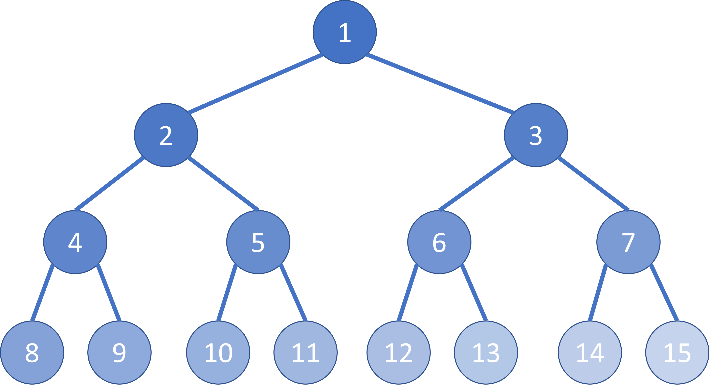

# TreesearchLib Overview

Andreas Beham
15/5/2023

---

# Use Case

TreesearchLib is a useful library, especially in the following cases:

 * The number of components that make up a complete solution is not fixed
 * You may want to exhaustively search the solution space, but also have heuristic methods available
 * Your problem has constraints, e.g., $\text{s.t.} \,\, g(x) \leq 0$ and it is either difficult to express constraint violation, i.e., $f(x) = f'(x) + \lambda \cdot \max \{ g(x), 0 \}$ or difficult to describe the sampling distribution and neighborhood functions used by the algorithms
 * You want to take advantage of problem-specific characteristics, i.e., you have an understanding of what makes a good solution

---

# Variable Number of Components

Consider the famous Tower of Hanoi problem. You have three pegs and a number of disks of different sizes. The goal is to move all disks from the first peg to the third peg, while never placing a larger disk on top of a smaller disk.

TreesearchLib facilitates expressing such problems, as the state space $S$ is only implicitely defined and you're only moving between valid states.

---

# Exhaustive Search

If you have a problem of low dimensionality, you certainly want to identify the optimal solution. There's hardly a reason why you'd want to employ a heuristic.

Of course, often your dimensionality is much much higher. So TreesearchLib also has heuristic algorithms. But in reality, your problem may actually be varying in dimensionality, as the amount of decision depends on the real-world scenario. Having a tool that guarantees global optimal solutions in your toolbox is a good thing.

---

# Constraints

Many improvement algorithms are unaware of constraints. Constraints are either part of the encoding, or the objective function accounts for the constraint violation. For instance, the fitness function of the Knapsack problem, can be expressed as:

$$\max_{x \in \{0, 1\}^n} \sum_{i=1}^n \text{profit}_i \cdot x_i - \lambda \cdot \max \{ \sum_{i=1}^n w_i \cdot x_i - W, 0 \}$$

To ensure that $\lambda$ is large enough such that every infeasible solution has a worse fitness than a feasible one is often non-trivial or rather ugly for real-world problems.

---

# Constraints

In TreesearchLib, constraints are implicitely defined by the choice function $C$. If a certain choice would lead to an infeasible solution, the choice function simply does not give you that choice.

In practice, this is rather easy to implement. Because, given a state, to say what is a valid next step is not that hard.

Of course, constraints may still be tricky and may make the problem very hard to solve. TreesearchLib is not a magic bullet.

---

# Problem-Specific Characteristics

Again, let's consider the Knapsack as an easy-to-understand example. For the problem we know that the ratio of profit to weight is important. Typically, we'd try the items with the highest ratio first. But it's not as straight-forward to implement such ordering preferences in other software.

In TreesearchLib we can express such preferences naturally and thus exploit this form of problem-specific knowledge.

---

# TreesearchLib Design

---

# IQuality

Is actually an `IComparable`. It tells you which of two states is better. There exists a discrete `Minimize` and `Maximize` implementation which provide a `Value` property.

The `Interface<T> where T : something` is a bit of a pattern and drew inspiration from the rust implementation. It avoids having interface types in the methods. We want to work with `T` and not `IQuality<T>`.

```csharp
public interface IQuality<T> : IComparable<T> where T : struct
{
    bool IsBetter(T other);
}
```

---

# Example: Minimize

```csharp
public struct Minimize : IQuality<Minimize>
{
    public int Value { get; private set; }
    public Minimize(int value)
    {
        Value = value;
    }

    public bool IsBetter(Minimize other) => Value < other.Value;

    public override string ToString() => $"min( {Value} )";

    public int CompareTo(Minimize other)
    {
        return Value.CompareTo(other.Value);
    }
}
```

---

# IQualifiable

That's a base interface for states. Note, that we need any such instance to be cloneable. For instance, when we find a new best state, we want to clone and store it away.

Again you see this pattern, I'm returning `TQuality` instead of a potential `IQuality` here, with the downside of having to express the generic constraint.

```csharp
public interface IQualifiable<TQuality> : ICloneable
    where TQuality : struct, IQuality<TQuality>
{
    bool IsTerminal { get; }
    TQuality Bound { get; }
    TQuality? Quality { get; }
}
```

---

# IState

The simplest way to use TreesearchLib is to implement this interface. Given a certain instance, you have to return all possible successor states.

Of course, each successor state has to be a clone of the current state.

```csharp
public interface IState<TState, TQuality> : IQualifiable<TQuality>
    where TState : IState<TState, TQuality>
    where TQuality : struct, IQuality<TQuality>
{
    IEnumerable<TState> GetBranches();
}
```

---

# Example: Knapsack

The order in which the branches are returned is important! Generally, the first branch is considered the "better" one. For instance, first branch first in depth-search.

```csharp
public IEnumerable<Knapsack> GetBranches()
{
    if (IsTerminal) yield break;
    for (var i = Decision.Length; i < Profits.Count; i++)
    {
        if (Weights[i] + TotalWeight <= Capacity)
        {
            yield return new Knapsack(this, true, i); // first branch
            yield return new Knapsack(this, false, i); // second branch
            yield break;
        }
    }
}
```

---

# IMutableState

Similar to `IState`, but it allows to undo the last choice. So you can have only a single instance of your state and that is manipulated by `Apply` and `UndoLast`.

Some algorithms still have to clone the state though, e.g. breadth-first or beam search.

```csharp
public interface IMutableState<TState, TChoice, TQuality> : IQualifiable<TQuality>
    where TState : class, IMutableState<TState, TChoice, TQuality>
    where TQuality : struct, IQuality<TQuality>
{
    IEnumerable<TChoice> GetChoices();
    void Apply(TChoice choice);
    void UndoLast();
}
```

---

# Example: Knapsack

```csharp
public IEnumerable<(bool, int)> GetChoices()
{
    if (IsTerminal) yield break;
    var item = Decision.Count > 0 ? Decision.Peek().Item2 : -1;
    for (var i = item + 1; i < Profits.Count; i++)
    {
        if (Weights[i] + TotalWeight <= Capacity)
        {
            yield return (true, i);
            yield return (false, i);
            yield break;
        }
    }
}
```

---

# IState vs IMutableState

Notes `IState`
 * Easier to implement
 * State can be made immutable
 * Cloning should be fast

Notes `IMutableState`
 * Provides a possibility to avoid deep cloning
 * Some algorithms can make use of that possibility

If the algorithm needs to do a lot of cloning anyway, e.g., breadth-based search algorithms, then `IMutableState` doesn't offer any advantage.

---

# ISearchControl

This is the main interface called by algorithms. An algorithm maintains its own state, but search control determines termination and advises algorithms to discard certain nodes.

```csharp
public interface ISearchControl<TState, TQuality>
    where TState : IQualifiable<TQuality> 
    where TQuality : struct, IQuality<TQuality> {

    TState InitialState { get; }
    TQuality? BestQuality { get; }
    TState BestQualityState { get; }

    bool ShouldStop();
    VisitResult VisitNode(TState state);

    ISearchControl<TState, TQuality> Fork(TState state,
        bool withBestQuality, TimeSpan? maxTimeLimit = default);
    void Merge(ISearchControl<TState, TQuality> other);
}
```

---

# ISearchControl

The method `VisitNode` is called everytime the algorithm comes across a node. `VisitResult` has just two states: Ok and Discard.

A custom search control is useful if you want to log all of the nodes or store them in a big hashset and check for duplicates. In the default implementation algorithms are advised to discard nodes when the bound is worse than the best quality found so far.

Fork/merge are special methods for parallel algorithms. Each thread forks the search control, searching, and then merging again. The algorithm only needs to lock the fork and merge operations which are rather infrequent.

---

# Stopping Conditions

1. Potentially algorithm specific stopping conditions
2. Wall-clock time limit
3. Number of visited nodes limit
4. CancellationToken

---

# Algorithms

---

# Algorithms

In TreesearchLib algorithms are implemented as static functions. There are several extension methods so that these can be called elegantly.

```csharp
var knapsack = new Knapsack(profits, weights, capacity);
// start with SearchControl
var control = Maximize.Start(knapsack)
                      .WithRuntimeLimit(TimeSpan.FromSeconds(1))
                      .BeamSearch(10, state => -state.Bound.Value);
var best = control.BestQualityState;
// start with state
best = knapsack.BeamSearch(10, state => -state.Bound.Value,
                           runtime: TimeSpan.FromSeconds(1));
// look ahead with Pilot Method
best = knapsack.PilotMethod(lookahead:
         LA.BeamSearchLookahead<Knapsack, bool, Maximize>
         (beamWidth: 10, rank: ksp => -ksp.Bound.Value));
```

---

# Depth vs Breadth vs Lookahead

<style scoped>
table {
  font-size: 24px;
}
</style>

| Algorithm | Parallel | Lookahead |
| --- | :---: | :---: |
| Depth-First Search | x | x |
| Breadth-First Search | x | |
| Limited Discrepancy Search | | x |
| Beam Search | x | x |
| Monotonic Beam Search | | x |
| Rake Search | x | x |
| Pilot Method | x | |
| Monte Carlo Tree Search | | |

---

# Depth-First Search

Depth-First Algorithm visits nodes in the tree from left to right, i.e., from first choice/branch to the last choice.

* FilterWidth: Maximum number of branches to consider
* BacktrackLimit: Maximum number of backtracking steps to perform (i.e., bounded backtrack search (BBS))
* DepthLimit: Maximum depth


---

# Parallel Depth-First Search

Perform a breadth-first search up to maxDegreeOfParallelism and then perform depth-first search in each branch concurrently.

Synchronize with other threads every second, e.g. to exchange upper bounds.


---

# Breadth-First Search

Breadth-First Algorithm explores all nodes of the same layer, before expanding the next layer.

* FilterWidth: Maximum number of branches to consider
* DepthLimit: Maximum depth



---

# Parallel Breadth-First Search

Similar to parallel depth-first search, it also performs a sequential breadth-first search up to maxDegreeOfParallelism and then performs breadth-first search in each branch concurrently.


---

# Limited Discrepancy Search


Limited Discrepancy Search is a depth-first search that assumes the first choice/branch is the best one, and you may only deviate from it a limited number of times.

Harvey, W.D. and Ginsberg, M.L., 1995, August. Limited discrepancy search. In IJCAI (1) (pp. 607-615).

I implemented two versions of Limited Discrepancy Search:

* Naive: Visits all nodes in order from left to right
* Anytime: Visits all nodes with lower discrepancy before those with higher discrepancy


---

# Limited Discrepancy Search

Discrepancy is the cumulative number of times the trajectory from root to leaf deviates from the first choice.

With $\text{LD}=1$ you may only vist those leaves where you had to take the second branch at most once.

It is equivalent to a depth-first search with $\text{LD}=\infty$.


---

# Limited Discrepancy Search

Harvey and Ginsberg describe LDS by applying a recursive function multiple times with $k \in \{1, 2, 3, \dots\, \text{LD}\}$ and each time visiting all nodes with discrepancy of exactly $k$.

TreesearchLib does it in one pass by remembering all nodes that would lead to a higher discrepancy (in the anytime variant).

The combination of LD and BBS given in the paper has not been implemented (yet).

---

# Beam Search

Beam Search is based on breadth-first search, but it keeps only at most a constant amount of nodes per layer.

* BeamWidth ($\beta$): Number of nodes to keep at each layer
* Rank: Ranking function to determine the best nodes
* FilterWidth: as breadth-first search
* DepthLimit: as breadth-first search

Beam search is equivalent to breadth-first search with $\beta=\infty$.

---

# Beam Search

A few points should be noted for beam search:

* The total computational effort can be calculated pretty well
* Writing good ranking functions is not trivial
* It may find worse solutions with higher $\beta$


---

# Beam Search

It may find worse solutions with higher $\beta$??

In this case $\beta=1$ finds the solution (*), but with $\beta=2$ the node D is less preferred to node E and F and thus, this branch is lost.


Lemons, S., López, C.L., Holte, R.C. and Ruml, W., 2022, June. Beam Search: Faster and Monotonic. In Proceedings of the International Conference on Automated Planning and Scheduling (Vol. 32, pp. 222-230).

---

# Monotonic Beam Search

Lemons et al. describe a simple modification of beam search: Beam $n$ uses only the best ranked among the first $n$ branches of each layer.

This ensures that the solution quality may not deteriorate with higher $\beta$. However, the algorithm isn't a net improvement over regular beam search.

* It may find worse solutions than Beam search with the same $\beta$
* It's more difficult to parallelize
* It's easier to tune $\beta$

TreesearchLib implements a sequential version only.

---

# Rake Search and Pilot Method

These heuristics use a lookahead to determine the best branch to explore next. Rake search will collect a couple of nodes (rakeWidth) using breadth search and then apply the lookahead, while the Pilot method applies the lookahead to all nodes of the current layer to decide on the best one to descend into.

* RakeWidth (Rake search only): Number of nodes to collect before applying the lookahead
* Lookahead: Lookahead algorithm to use

A simple lookahead is for instance BBS (depth-first search with backtrackLimit).

---

# Pilot Method


---

# Monte Carlo Tree Search

Monte Carlo Tree Search iteratively samples a path from the root to a leaf node and then updates the node's weight in how often it leads to success. A node may thus return 1 in case of success or 0 in case of failure. To decide on the next node, it uses the upper confidence bound applied to trees:

$$\text{UCT}(n) = \frac{w(n)}{n} + c \sqrt{\frac{\ln N}{n}}$$

where $w(n)$ is the weight of the node, $n$ is the number of times the node has been visited, $N$ is the number of times the parent node has been visited, and $c$ is a constant.

The constant is $c = \sqrt{2}$ for the original UCT algorithm. I implemented an adaption of the constant for $w(n) \notin \{0, 1\}$, but that's a little bit experimental.

---

# Common Pitfalls

Unfortunately, there are also some pitfalls that occurr quite frequently:

* Apply/UndoLast have to match each other perfectly
* Errors in cloning can lead to very strange results

I thus implemented a generic unit test. This checks whether the same move is still suggested after an apply/undo cycle. It also involves cloning at certain stages to also check for problems with that.

```csharp
knapsack.Test<Knapsack, (bool, int), Maximize>(EqualityComparer<(bool, int)>.Default)
```

---

# Outlook

The library is still in its infancy and there are many things that could be improved. I'm happy to receive feedback and contributions.

There are still many things that can be improved:

 * Additional algorithms
 * Parallelization of some existing algorithms
 * Better parallelization of breadth-first search/beam search
 * Adding deduplication
 * Simplifying the API
 * Better documentation
